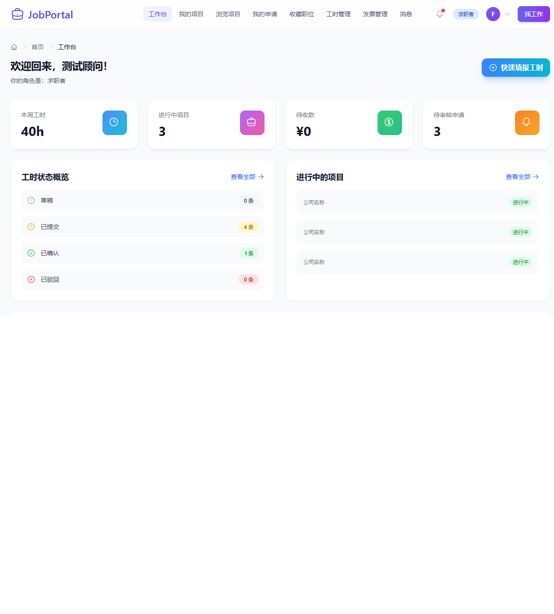
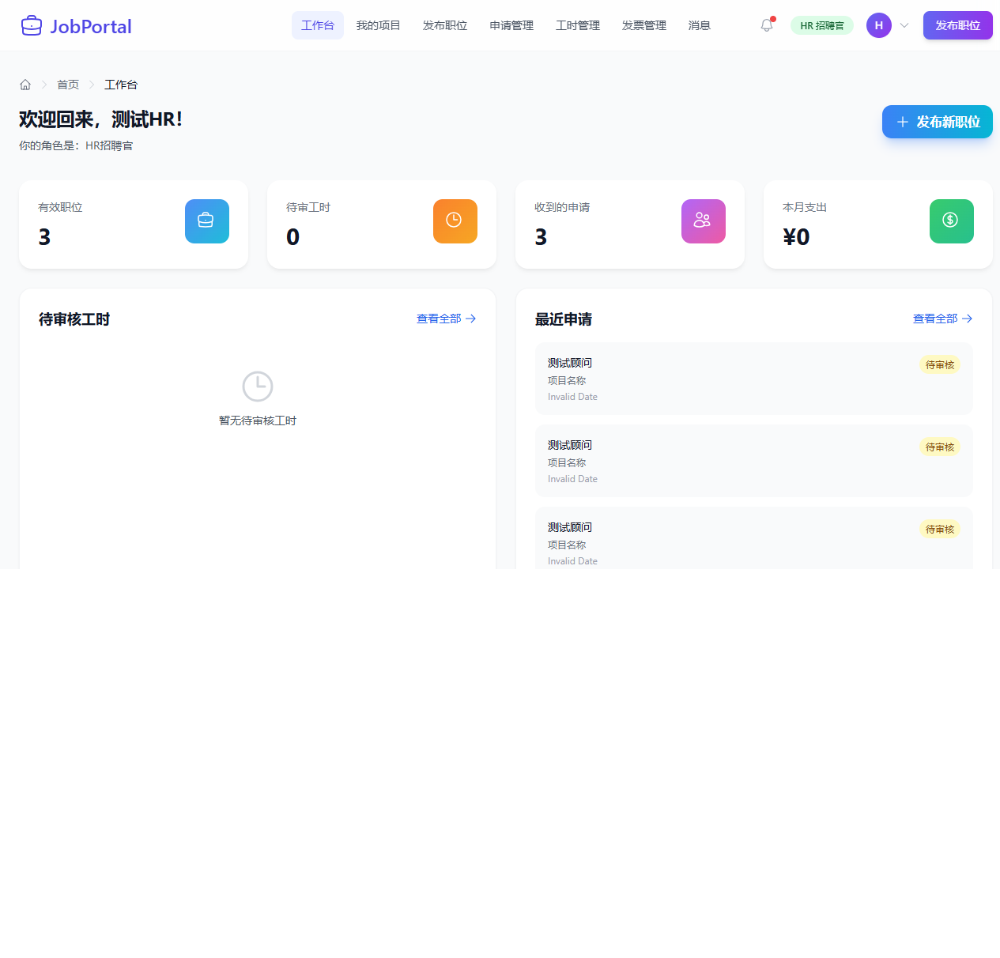
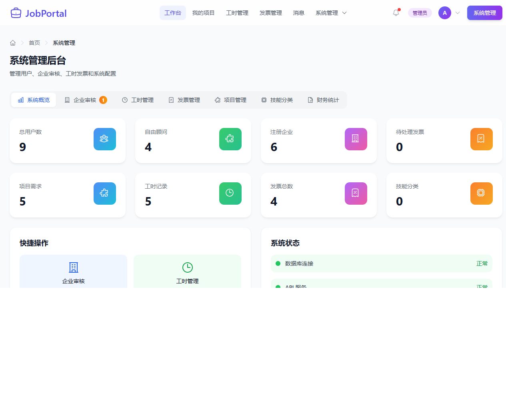
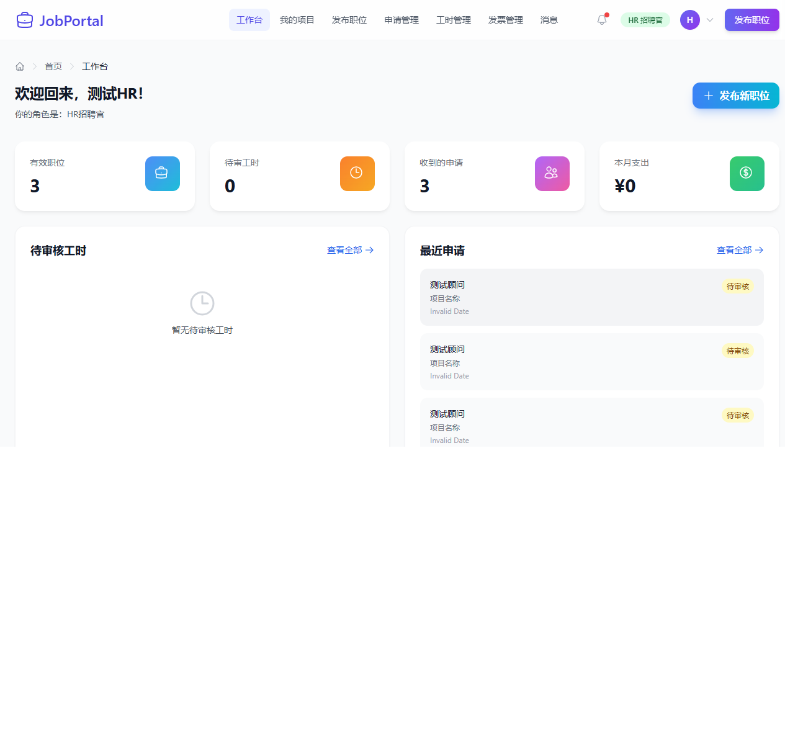
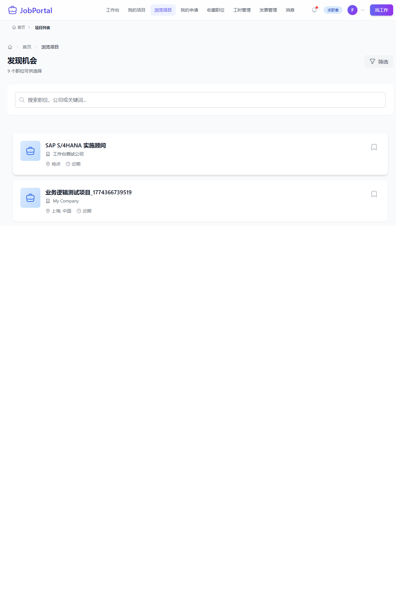

# JobPortal - SAP Consultant Freelance Platform

[中文文档](#jobportal---sap顾问自由职业平台) | [English Documentation](#english-documentation)

---

# English Documentation

A modern recruitment platform connecting Freelancers, HR Recruiters, and Company Administrators.

## 🌟 Core Features

### 👤 Freelancer Dashboard
- ✅ **Dashboard** - Display weekly hours, active projects, pending payments, pending applications
- ✅ **Project Management** - View active projects, project details, work logs
- ✅ **Job Browsing** - Browse and search jobs, apply for positions
- ✅ **Application Management** - View application status, application history
- ✅ **Work Log Management** - Submit work logs, view work statistics

### 👔 HR Recruiter Dashboard
- ✅ **Dashboard** - Display active jobs, pending work logs, received applications, monthly expenses
- ✅ **Job Posting** - Post new jobs, manage posted jobs
- ✅ **Application Review** - View applicant applications, review application status
- ✅ **Work Log Review** - Review work logs submitted by consultants

### 🔧 System Administrator Dashboard
- ✅ **Dashboard** - Display total users, freelancers, registered companies, pending invoices, etc.
- ✅ **User Management** - Manage user accounts, role permissions
- ✅ **Company Management** - Review company registrations, manage company information
- ✅ **Data Statistics** - Project requirements, work logs, total invoices statistics

### 🔐 Authentication & Authorization
- ✅ **User Authentication** - Login/Register/Logout
- ✅ **Role-based Permissions** - Role-based Access Control (RBAC)
- ✅ **Dynamic Menu** - Display different menus based on user roles

## 🛠️ Tech Stack

### Frontend
- **React 18** - UI Framework
- **TypeScript** - Type Safety
- **Tailwind CSS** - Styling Framework
- **React Router v6** - Routing
- **Axios** - HTTP Client
- **React Query** - Data Fetching & Caching

### Backend
- **Node.js** - Runtime
- **Express** - Web Framework
- **MongoDB** - Database
- **Mongoose** - ODM
- **JWT** - Authentication
- **Passport.js** - Authentication Middleware

### Dev Tools
- **Docker & Docker Compose** - Containerization
- **Playwright** - E2E Testing
- **Vite** - Frontend Build Tool

## 🚀 Quick Start

### Prerequisites
- Node.js 18+
- MongoDB 4.4+
- Docker (Optional)

### Using Docker (Recommended)

```bash
# Start all services
docker-compose up -d

# Access the application
# Frontend: http://localhost:5137
# Backend API: http://localhost:5555/api/v1
```

### Manual Start

#### Backend
```bash
cd JobPortal/server
npm install
npm run dev
```

#### Frontend
```bash
cd JobPortal/client
npm install
npm run dev
```

## 📝 Test Accounts

| Role | Email | Password |
|------|-------|----------|
| Freelancer | freelancer@test.com | Test123456! |
| HR Recruiter | hr@test.com | Test123456! |
| Admin | admin@test.com | Test123456! |
| Super Admin | admin@jobportal.com | Admin@123 |

## 📊 Database Schema

### Main Collections
- `user_account` - User Accounts
- `user_role` - User Roles
- `freelancer_profile` - Freelancer Profiles
- `company` - Company Information
- `job_post` - Job Posts
- `job_post_activity` - Job Applications
- `work_log` - Work Logs
- `invoice` - Invoices

## 🧪 Testing

### E2E Testing
```bash
# Run cross-role end-to-end tests
npx playwright test e2e-tests/cross-role-e2e.spec.ts --headed

# Run dashboard data validation tests
npx playwright test e2e-tests/dashboard-data.spec.ts --headed

# Run debug tests
npx playwright test e2e-tests/debug-white-screen.spec.ts --headed
```

### Test Results
- ✅ E2E-01: Freelancer Dashboard Complete Flow - Passed
- ✅ E2E-02: HR Dashboard Complete Flow - Passed
- ✅ E2E-03: Admin Dashboard Complete Flow - Passed
- ✅ E2E-04: API Data Validation - Passed
- ✅ E2E-05: Cross-role Complete Business Flow - Passed
- ✅ E2E-06: Page Navigation and Permission Validation - Passed

**Total: 6/6 Passed (100%)**

## 📸 Screenshots

### Freelancer Dashboard


### HR Dashboard


### Admin Dashboard


### HR Post Job


### HR View Applications


### Freelancer Browse Jobs


## 📁 Project Structure

```
JobPortal/
├── JobPortal/
│   ├── client/                    # Frontend Code
│   │   └── src/
│   │       ├── components/        # Components
│   │       │   ├── core-ui/       # Core UI Components
│   │       │   ├── layouts/       # Layout Components
│   │       │   └── navigation/    # Navigation Components
│   │       ├── pages/             # Pages
│   │       ├── services/          # API Services
│   │       ├── providers/         # Context Providers
│   │       ├── hooks/             # Custom Hooks
│   │       └── constants/         # Constants
│   └── server/                    # Backend Code
│       └── src/
│           ├── controllers/       # Controllers
│           ├── models/            # Data Models
│           ├── routes/            # Routes
│           ├── middlewares/       # Middlewares
│           └── seeders/           # Data Seeders
├── e2e-tests/                     # E2E Tests
├── docs/                          # Documentation
├── docker-compose.yml
└── README.md
```

## 🔧 Configuration

### Environment Variables
```bash
# Backend Configuration
MONGO_URL=mongodb://localhost:27017/jobportal
JWT_SECRET=your-secret-key
PORT=5555

# Frontend Configuration
VITE_API_URL=http://localhost:5555/api/v1
```

## 🔄 Recent Updates

### 2026-03-28
- 🐛 Fixed StorageService JSON parsing error causing white screen
- 🐛 Fixed AuthProvider data parsing error causing role judgment failure
- ✨ Added cross-role end-to-end E2E tests
- ✨ Optimized dashboard data loading logic
- ✨ Added debug logs for troubleshooting

## 🤝 Contributing

Contributions are welcome! Please follow these steps:

1. Fork this project
2. Create a feature branch (`git checkout -b feature/AmazingFeature`)
3. Commit your changes (`git commit -m 'Add some AmazingFeature'`)
4. Push to the branch (`git push origin feature/AmazingFeature`)
5. Open a Pull Request

## 📄 License

MIT License

## 📞 Contact

- GitHub: https://github.com/kerrykuang2023/JobPortal
- For questions or suggestions, please submit an Issue

---

# JobPortal - SAP顾问自由职业平台

一个现代化的招聘平台，连接自由顾问（Freelancer）、HR招聘者和企业管理员。

## 🌟 核心功能

### 👤 自由顾问 (Freelancer) 工作台
- ✅ **工作台仪表板** - 显示本周工时、进行中项目、待收款、待审核申请
- ✅ **项目管理** - 查看进行中的项目、项目详情、工时记录
- ✅ **职位浏览** - 浏览和搜索职位、申请职位
- ✅ **申请管理** - 查看申请状态、申请历史
- ✅ **工时管理** - 提交工时记录、查看工时统计

### 👔 HR招聘者 (HR Recruiter) 工作台
- ✅ **工作台仪表板** - 显示有效职位、待审工时、收到的申请、本月支出
- ✅ **职位发布** - 发布新职位、管理已发布职位
- ✅ **申请审核** - 查看求职者申请、审核申请状态
- ✅ **工时审核** - 审核顾问提交的工时记录

### 🔧 系统管理员 (Admin) 工作台
- ✅ **工作台仪表板** - 显示总用户数、自由顾问、注册企业、待处理发票等
- ✅ **用户管理** - 管理用户账户、角色权限
- ✅ **企业管理** - 审核企业注册、管理企业信息
- ✅ **数据统计** - 项目需求、工时记录、发票总数等统计

### 🔐 认证与权限
- ✅ **用户认证** - 登录/注册/登出
- ✅ **角色权限** - 基于角色的访问控制 (RBAC)
- ✅ **动态菜单** - 根据用户角色显示不同菜单

## 🛠️ 技术栈

### 前端
- **React 18** - UI 框架
- **TypeScript** - 类型安全
- **Tailwind CSS** - 样式框架
- **React Router v6** - 路由管理
- **Axios** - HTTP 客户端
- **React Query** - 数据获取和缓存

### 后端
- **Node.js** - 运行时
- **Express** - Web 框架
- **MongoDB** - 数据库
- **Mongoose** - ODM
- **JWT** - 身份认证
- **Passport.js** - 认证中间件

### 开发工具
- **Docker & Docker Compose** - 容器化
- **Playwright** - E2E 测试
- **Vite** - 前端构建工具

## 🚀 快速开始

### 环境要求
- Node.js 18+
- MongoDB 4.4+
- Docker (可选)

### 使用 Docker（推荐）

```bash
# 启动所有服务
docker-compose up -d

# 访问应用
# 前端：http://localhost:5137
# 后端 API: http://localhost:5555/api/v1
```

### 手动启动

#### 后端
```bash
cd JobPortal/server
npm install
npm run dev
```

#### 前端
```bash
cd JobPortal/client
npm install
npm run dev
```

## 📝 测试账号

| 角色 | 邮箱 | 密码 |
|------|------|------|
| 自由顾问 | freelancer@test.com | Test123456! |
| HR招聘者 | hr@test.com | Test123456! |
| 系统管理员 | admin@test.com | Test123456! |
| 超级管理员 | admin@jobportal.com | Admin@123 |

## 📊 数据库结构

### 主要集合
- `user_account` - 用户账户
- `user_role` - 用户角色
- `freelancer_profile` - 顾问档案
- `company` - 公司信息
- `job_post` - 职位信息
- `job_post_activity` - 职位申请
- `work_log` - 工时记录
- `invoice` - 发票信息

## 🧪 测试

### E2E 测试
```bash
# 运行跨角色全链路测试
npx playwright test e2e-tests/cross-role-e2e.spec.ts --headed

# 运行工作台数据验证测试
npx playwright test e2e-tests/dashboard-data.spec.ts --headed

# 运行调试测试
npx playwright test e2e-tests/debug-white-screen.spec.ts --headed
```

### 测试结果
- ✅ E2E-01: Freelancer 工作台完整流程 - 通过
- ✅ E2E-02: HR 工作台完整流程 - 通过
- ✅ E2E-03: Admin 工作台完整流程 - 通过
- ✅ E2E-04: API 数据验证 - 通过
- ✅ E2E-05: 跨角色完整业务流程 - 通过
- ✅ E2E-06: 页面导航和权限验证 - 通过

**总计: 6/6 通过 (100%)**

## 📸 系统截图

### Freelancer 工作台


### HR 工作台


### Admin 工作台


### HR 发布职位


### HR 查看申请


### Freelancer 浏览职位


## 📁 项目结构

```
JobPortal/
├── JobPortal/
│   ├── client/                    # 前端代码
│   │   └── src/
│   │       ├── components/        # 组件
│   │       │   ├── core-ui/       # 核心UI组件
│   │       │   ├── layouts/       # 布局组件
│   │       │   └── navigation/    # 导航组件
│   │       ├── pages/             # 页面
│   │       ├── services/          # API服务
│   │       ├── providers/         # Context Provider
│   │       ├── hooks/             # 自定义Hooks
│   │       └── constants/         # 常量配置
│   └── server/                    # 后端代码
│       └── src/
│           ├── controllers/       # 控制器
│           ├── models/            # 数据模型
│           ├── routes/            # 路由
│           ├── middlewares/       # 中间件
│           └── seeders/           # 数据填充
├── e2e-tests/                     # E2E测试
├── docs/                          # 文档
├── docker-compose.yml
└── README.md
```

## 🔧 配置

### 环境变量
```bash
# 后端配置
MONGO_URL=mongodb://localhost:27017/jobportal
JWT_SECRET=your-secret-key
PORT=5555

# 前端配置
VITE_API_URL=http://localhost:5555/api/v1
```

## 🔄 最近更新

### 2026-03-28
- 🐛 修复 StorageService JSON 解析错误导致的页面白屏问题
- 🐛 修复 AuthProvider 数据解析错误导致的角色判断失败
- ✨ 添加跨角色全链路 E2E 测试
- ✨ 优化工作台数据加载逻辑
- ✨ 添加调试日志便于问题排查

## 🤝 贡献

欢迎贡献代码！请遵循以下步骤：

1. Fork 本项目
2. 创建特性分支 (`git checkout -b feature/AmazingFeature`)
3. 提交更改 (`git commit -m 'Add some AmazingFeature'`)
4. 推送到分支 (`git push origin feature/AmazingFeature`)
5. 开启 Pull Request

## 📄 许可证

MIT License

## 📞 联系方式

- GitHub: https://github.com/kerrykuang2023/JobPortal
- 如有问题或建议，请提交 Issue

---

**开发时间**: 2026-03-19  
**最后更新**: 2026-03-30  
**版本**: 1.0.0
