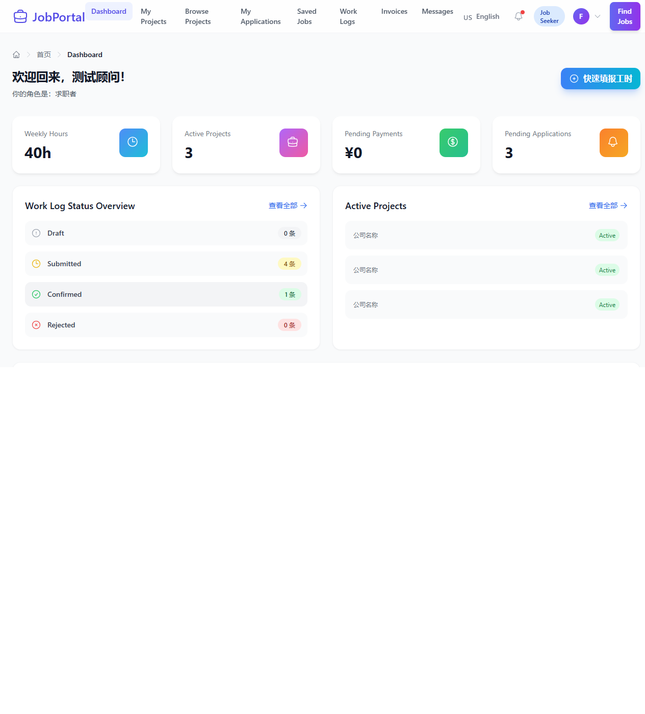
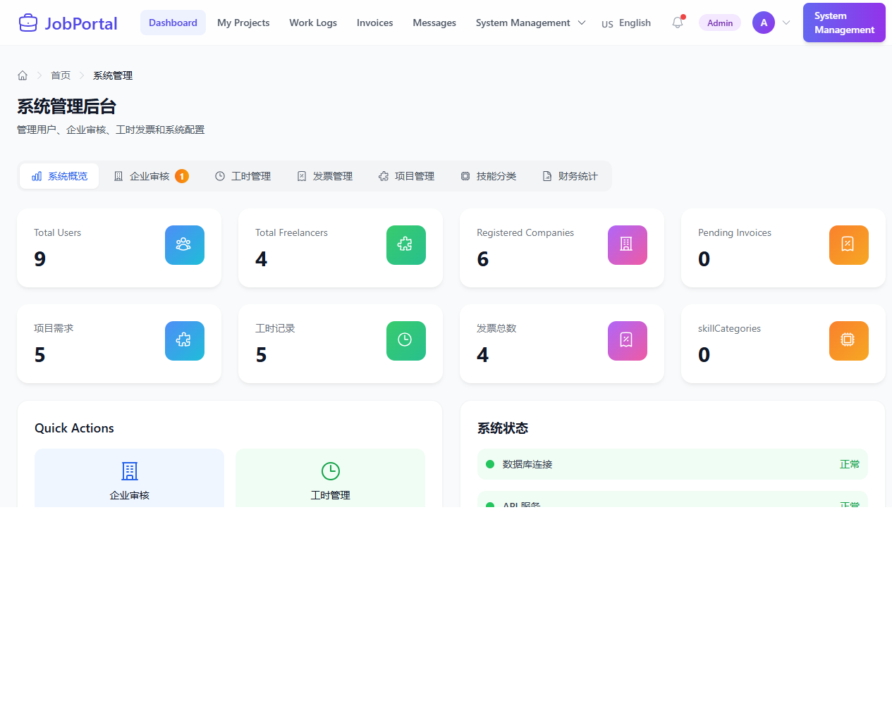
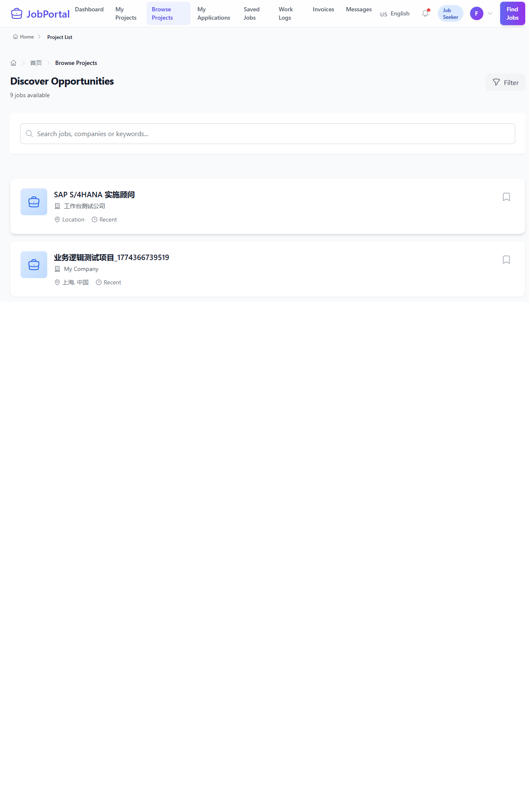
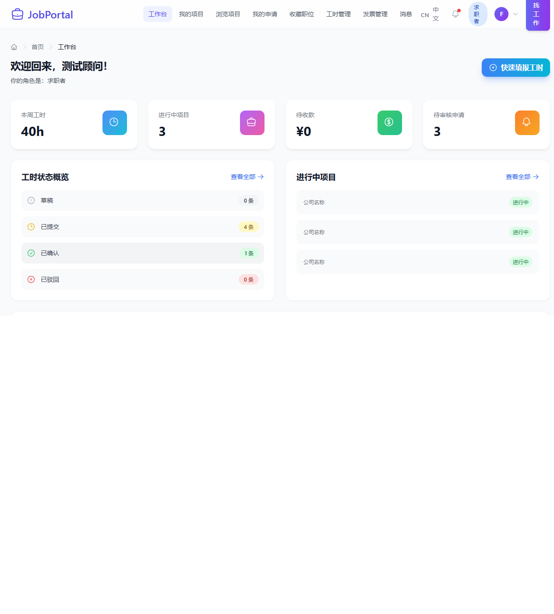

# JobPortal - SAP顾问自由职业平台

<p align="center">
  <a href="README.md"><b>🇺🇸 Switch to English</b></a>
</p>

[](https://opensource.org/licenses/MIT)
[](https://reactjs.org/)
[](https://www.typescriptlang.org/)
[](https://www.mongodb.com/)
[](https://nodejs.org/)
[](https://www.docker.com/)

---

## 📖 目录

- [项目概述](#项目概述)
- [核心特色](#-核心特色)
- [系统截图](#-系统截图)
- [技术栈](#-技术栈)
- [快速开始](#-快速开始)
- [项目结构](#-项目结构)
- [API文档](#-api文档)
- [测试](#-测试)
- [开发路线图](#-开发路线图)
- [贡献指南](#-贡献指南)
- [许可证](#-许可证)

---

<a name="项目概述"></a>
## 项目概述

**JobPortal** 是一个现代化的企业级招聘平台，专为SAP顾问和自由职业者设计。通过直观的多语言界面，实现自由顾问、HR招聘者和企业管理员之间的无缝连接。

### 为什么选择 JobPortal？

| 挑战 | 解决方案 |
|------|----------|
| 🔍 **寻找SAP人才困难** | 专为SAP顾问打造的专业平台 |
| 🌍 **语言障碍** | 完整国际化支持（中文、英文、日文） |
| 📊 **项目管理复杂** | 集成工时记录、发票和支付管理 |
| 🔐 **安全顾虑** | 基于角色的访问控制 (RBAC) |
| 📱 **移动访问需求** | 响应式设计，适配所有设备 |

---

<a name="-核心特色"></a>
## 🌟 核心特色

### 🌐 国际化 (i18n)

| 功能 | 描述 |
|------|------|
| **多语言支持** | 完整支持中文、英文和日文 |
| **动态语言切换** | 无需刷新页面即可实时切换语言 |
| **完整翻译覆盖** | 所有UI元素、菜单、按钮和消息均已翻译 |
| **语言持久化** | 用户语言偏好保存在 localStorage 中 |
| **易于扩展** | 轻松添加更多语言支持 |

### 👤 自由顾问 (Freelancer) 工作台

```
┌─────────────────────────────────────────────────────────────┐
│  📊 工作台概览                                                │
├─────────────────────────────────────────────────────────────┤
│  ⏱️ 本周工时    📁 进行中项目                                  │
│  💰 待收款      📬 待审核申请                                  │
├─────────────────────────────────────────────────────────────┤
│  📋 项目管理                                                  │
│  ├── 查看进行中项目                                           │
│  ├── 项目详情与里程碑                                          │
│  └── 工时记录追踪                                              │
├─────────────────────────────────────────────────────────────┤
│  💼 职位浏览与申请                                             │
│  ├── 搜索和筛选职位                                           │
│  ├── 申请职位                                                 │
│  └── 追踪申请状态                                              │
├─────────────────────────────────────────────────────────────┤
│  ⏱️ 工时管理                                                  │
│  ├── 提交每日/每周工时                                        │
│  ├── 查看工时统计                                             │
│  └── 导出报告                                                 │
└─────────────────────────────────────────────────────────────┘
```

### 👔 HR招聘者 (HR Recruiter) 工作台

| 功能 | 描述 |
|------|------|
| **工作台概览** | 有效职位、待审工时、收到的申请、本月支出 |
| **职位发布** | 创建、编辑和管理职位发布，支持富文本编辑器 |
| **申请审核** | 查看求职者资料、技能和工作经历 |
| **工时审批** | 批准或拒绝顾问工时记录，可添加备注 |
| **团队管理** | 管理团队成员和权限 |

### 🔧 系统管理员 (Admin) 工作台

```
┌─────────────────────────────────────────────────────────────┐
│  📊 系统概览                                                  │
├─────────────────────────────────────────────────────────────┤
│  👥 总用户数    🏢 注册企业                                    │
│  📋 总项目数    💰 总发票数                                    │
├─────────────────────────────────────────────────────────────┤
│  👤 用户管理                                                  │
│  ├── 用户账户增删改查                                         │
│  ├── 角色分配                                                 │
│  └── 权限管理                                                 │
├─────────────────────────────────────────────────────────────┤
│  🏢 企业管理                                                  │
│  ├── 企业注册审核                                             │
│  ├── 认证工作流                                               │
│  └── 企业资料管理                                              │
├─────────────────────────────────────────────────────────────┤
│  ⚙️ 系统配置                                                  │
│  ├── 技能分类 (SAP, ERP, CRM 等)                              │
│  ├── 工作类型 (远程, 现场, 混合)                               │
│  ├── 税率与货币                                               │
│  └── 语言要求                                                 │
└─────────────────────────────────────────────────────────────┘
```

### 🔐 认证与授权

| 功能 | 实现方式 |
|------|----------|
| **用户认证** | 基于JWT的认证，支持刷新令牌 |
| **角色访问控制** | 多角色支持（自由顾问、HR、管理员） |
| **动态菜单** | 根据角色显示特定导航和功能 |
| **会话管理** | 安全的会话处理，支持自动登出 |
| **密码安全** | Bcrypt加密，带盐值轮次 |

---

<a name="-系统截图"></a>
## 📸 系统截图

### 🔐 登录页面 - 多语言支持

| 中文 | English | 日本語 |
|:----:|:-------:|:------:|
| [](docs/screenshots/readme/login-zh.png) | [](docs/screenshots/readme/login-en.png) | [](docs/screenshots/readme/login-ja.png) |

> 📌 点击图片查看大图

### 📊 工作台视图

| 自由顾问工作台 | 管理员工作台 |
|:--------------:|:------------:|
| [](docs/screenshots/readme/freelancer-dashboard-en.png) | [](docs/screenshots/readme/admin-dashboard-en.png) |

### 🎯 功能亮点

| 职位列表 | 中文工作台 |
|:--------:|:----------:|
| [](docs/screenshots/readme/jobs-list-en.png) | [](docs/screenshots/readme/freelancer-dashboard-zh.png) |

---

<a name="-技术栈"></a>
## 🛠️ 技术栈

### 前端架构

```
┌─────────────────────────────────────────────────────────────┐
│                        前端技术栈                             │
├─────────────────────────────────────────────────────────────┤
│  框架             │ React 18 + TypeScript                   │
│  状态管理         │ React Query + Context API               │
│  样式             │ Tailwind CSS + CSS Modules              │
│  路由             │ React Router v6                         │
│  国际化           │ i18next + react-i18next                 │
│  HTTP客户端       │ Axios 拦截器                            │
│  构建工具         │ Vite                                    │
│  测试             │ Playwright (E2E) + Vitest (单元)        │
└─────────────────────────────────────────────────────────────┘
```

### 后端架构

```
┌─────────────────────────────────────────────────────────────┐
│                        后端技术栈                             │
├─────────────────────────────────────────────────────────────┤
│  运行时           │ Node.js 18+                             │
│  框架             │ Express.js                              │
│  数据库           │ MongoDB 7 + Mongoose ODM                │
│  认证             │ JWT + Passport.js                       │
│  验证             │ Joi / express-validator                 │
│  文件上传         │ Multer                                  │
│  API文档          │ Swagger / OpenAPI                       │
└─────────────────────────────────────────────────────────────┘
```

### DevOps 与工具

| 工具 | 用途 |
|------|------|
| **Docker** | 容器化，确保环境一致性 |
| **Docker Compose** | 多容器编排 |
| **Playwright** | 端到端测试 |
| **ESLint** | 代码检查和格式化 |
| **Prettier** | 代码格式化 |
| **Husky** | Git钩子，提交前检查 |

---

<a name="-快速开始"></a>
## 🚀 快速开始

### 环境要求

| 要求 | 版本 | 检查命令 |
|------|------|----------|
| Node.js | 18+ | `node --version` |
| MongoDB | 4.4+ | `mongod --version` |
| Docker | 20+ | `docker --version` |
| npm | 9+ | `npm --version` |

### 方式一：Docker（推荐）

```bash
# 克隆仓库
git clone https://github.com/kerrykuang2023/JobPortal.git
cd JobPortal

# 启动所有服务
docker-compose up -d

# 访问应用
# 前端：http://localhost:5137
# 后端 API: http://localhost:5555/api/v1
```

### 方式二：手动启动

```bash
# 1. 克隆并设置后端
git clone https://github.com/kerrykuang2023/JobPortal.git
cd JobPortal/JobPortal/server
npm install
cp .env.example .env
npm run dev

# 2. 设置前端（新终端）
cd JobPortal/JobPortal/client
npm install
cp .env.example .env
npm run dev
```

### 测试账号

| 角色 | 邮箱 | 密码 | 访问权限 |
|------|------|------|----------|
| 自由顾问 | freelancer@test.com | Test123456! | 职位浏览、申请、工时记录 |
| HR招聘者 | hr@test.com | Test123456! | 职位发布、申请审核 |
| 管理员 | admin@test.com | Test123456! | 完整系统访问 |
| 超级管理员 | admin@jobportal.com | Admin@123 | 系统配置 |

---

<a name="-项目结构"></a>
## 📁 项目结构

```
JobPortal/
├── 📁 JobPortal/
│   ├── 📁 client/                    # 前端应用
│   │   ├── 📁 src/
│   │   │   ├── 📁 components/        # 可复用UI组件
│   │   │   │   ├── 📁 common/        # 通用组件 (Button, Modal等)
│   │   │   │   ├── 📁 core-ui/       # 核心UI组件
│   │   │   │   ├── 📁 forms/         # 表单组件
│   │   │   │   ├── 📁 layouts/       # 布局组件
│   │   │   │   └── 📁 navigation/    # 导航组件
│   │   │   ├── 📁 pages/             # 页面组件
│   │   │   │   ├── 📁 AuthPages/     # 登录、注册等
│   │   │   │   ├── 📁 Dashboard/     # 工作台页面
│   │   │   │   └── 📁 Admin/         # 管理页面
│   │   │   ├── 📁 services/          # API服务层
│   │   │   ├── 📁 hooks/             # 自定义React Hooks
│   │   │   ├── 📁 i18n/              # 国际化
│   │   │   │   └── 📁 locales/       # 翻译文件
│   │   │   │       ├── 📁 zh/        # 中文翻译
│   │   │   │       ├── 📁 en/        # 英文翻译
│   │   │   │       └── 📁 ja/        # 日文翻译
│   │   │   ├── 📁 providers/         # React Context Providers
│   │   │   ├── 📁 interfaces/        # TypeScript接口
│   │   │   └── 📁 utils/             # 工具函数
│   │   ├── 📄 package.json
│   │   └── 📄 vite.config.ts
│   │
│   └── 📁 server/                    # 后端应用
│       ├── 📁 src/
│       │   ├── 📁 controllers/       # 路由控制器
│       │   ├── 📁 models/            # Mongoose模型
│       │   ├── 📁 routes/            # API路由
│       │   ├── 📁 middlewares/       # Express中间件
│       │   ├── 📁 services/          # 业务逻辑
│       │   ├── 📁 validators/        # 请求验证
│       │   └── 📁 utils/             # 工具函数
│       ├── 📄 package.json
│       └── 📄 tsconfig.json
│
├── 📁 e2e-tests/                     # 端到端测试
│   ├── 📄 i18n-language-switch.spec.ts
│   ├── 📄 cross-role-e2e.spec.ts
│   └── 📄 dashboard-data.spec.ts
│
├── 📁 docs/                          # 文档
│   └── 📁 screenshots/               # 截图
│
├── 📄 README.md                      # 英文文档
├── 📄 README_ZH.md                   # 中文文档
├── 📄 docker-compose.yml             # Docker配置
└── 📄 package.json                   # 根package.json
```

---

<a name="-api文档"></a>
## 📚 API文档

### 认证接口

| 方法 | 端点 | 描述 |
|------|------|------|
| POST | `/api/v1/auth/register` | 注册新用户 |
| POST | `/api/v1/auth/login` | 用户登录 |
| POST | `/api/v1/auth/logout` | 用户登出 |
| POST | `/api/v1/auth/refresh` | 刷新访问令牌 |
| GET | `/api/v1/auth/me` | 获取当前用户 |

### 职位接口

| 方法 | 端点 | 描述 | 角色 |
|------|------|------|------|
| GET | `/api/v1/jobs` | 获取职位列表 | 所有 |
| GET | `/api/v1/jobs/:id` | 获取职位详情 | 所有 |
| POST | `/api/v1/jobs` | 创建新职位 | HR, Admin |
| PUT | `/api/v1/jobs/:id` | 更新职位 | HR, Admin |
| DELETE | `/api/v1/jobs/:id` | 删除职位 | Admin |

### 工时记录接口

| 方法 | 端点 | 描述 | 角色 |
|------|------|------|------|
| GET | `/api/v1/work-logs` | 获取工时列表 | 所有 |
| POST | `/api/v1/work-logs` | 创建工时记录 | Freelancer |
| PUT | `/api/v1/work-logs/:id/confirm` | 确认工时记录 | HR |
| PUT | `/api/v1/work-logs/:id/reject` | 拒绝工时记录 | HR |

### 管理接口

| 方法 | 端点 | 描述 | 角色 |
|------|------|------|------|
| GET | `/api/v1/admin/users` | 获取用户列表 | Admin |
| GET | `/api/v1/admin/companies` | 获取企业列表 | Admin |
| PUT | `/api/v1/admin/companies/:id/verify` | 认证企业 | Admin |
| GET | `/api/v1/admin/config/:type` | 获取系统配置 | Admin |

---

<a name="-测试"></a>
## 🧪 测试

### 运行E2E测试

```bash
# 运行所有测试
npx playwright test

# 运行特定测试文件
npx playwright test e2e-tests/i18n-language-switch.spec.ts --headed

# 使用UI模式运行
npx playwright test --ui

# 生成测试报告
npx playwright show-report
```

### 测试覆盖

| 测试套件 | 覆盖范围 | 描述 |
|----------|----------|------|
| 国际化测试 | 15个测试 | 多语言切换验证 |
| 跨角色测试 | 20+个测试 | 角色访问控制 |
| 工作台测试 | 10+个测试 | 数据展示和交互 |
| 认证测试 | 10+个测试 | 认证流程 |

---

<a name="-开发路线图"></a>
## 🗺️ 开发路线图

### v1.1.0 (当前版本)
- [x] 多语言支持（中文、英文、日文）
- [x] 自由顾问工作台
- [x] HR工作台
- [x] 管理员工作台
- [x] 工时记录管理
- [x] 发票管理

### v1.2.0 (计划中)
- [ ] 实时通知
- [ ] 视频面试集成
- [ ] 高级搜索与筛选
- [ ] 移动端应用 (React Native)

### v2.0.0 (未来规划)
- [ ] AI智能职位匹配
- [ ] 区块链智能合约
- [ ] 多租户架构
- [ ] 高级数据分析工作台

---

<a name="-贡献指南"></a>
## 🤝 贡献指南

欢迎参与贡献！请遵循以下步骤：

1. **Fork** 本仓库
2. **创建** 特性分支 (`git checkout -b feature/AmazingFeature`)
3. **提交** 更改 (`git commit -m 'Add some AmazingFeature'`)
4. **推送** 到分支 (`git push origin feature/AmazingFeature`)
5. **开启** Pull Request

### 开发规范

- 遵循现有代码风格
- 为新功能编写测试
- 及时更新文档
- 保持PR聚焦和小型化

---

<a name="-许可证"></a>
## 📄 许可证

本项目采用 MIT 许可证 - 详情请查看 [LICENSE](LICENSE) 文件。

---

## 📞 联系与支持

| 类型 | 链接 |
|------|------|
| 📧 邮箱 | support@jobportal.com |
| 🐛 问题反馈 | [GitHub Issues](https://github.com/kerrykuang2023/JobPortal/issues) |
| 💬 讨论 | [GitHub Discussions](https://github.com/kerrykuang2023/JobPortal/discussions) |

---

<p align="center">
  <b>创建时间</b>: 2026-03-19 &nbsp;|&nbsp; 
  <b>最后更新</b>: 2026-03-30 &nbsp;|&nbsp; 
  <b>版本</b>: 1.1.0
</p>

<p align="center">
  <a href="README.md"><b>🇺🇸 Switch to English</b></a>
</p>
